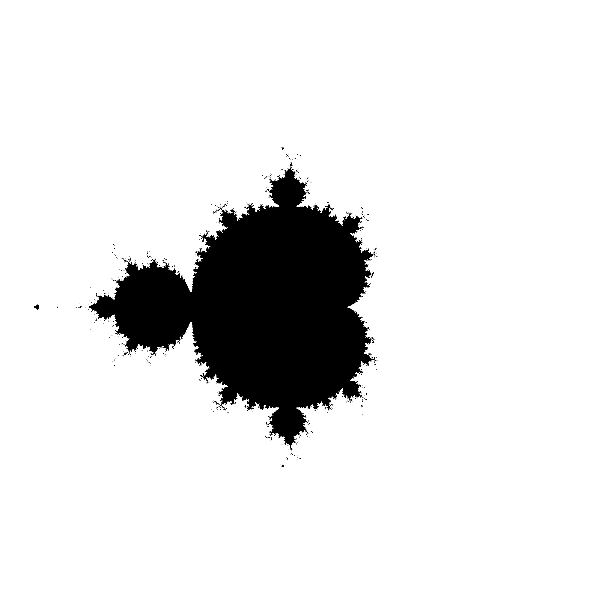

# A Gentle Introduction Into The Mandelbrot Set

## Description

This serves as a gentle introduction to both Rust and the worlderful world of fractal rendering.
The current branch (l4_orbit_trapping) provides an implementation of a Mandelbrot set renderer which includes coloring based on orbit trapping, on top of the ability to zoom into the set.
For more complex upgrades, you can visit the other branches.

## Screenshots

