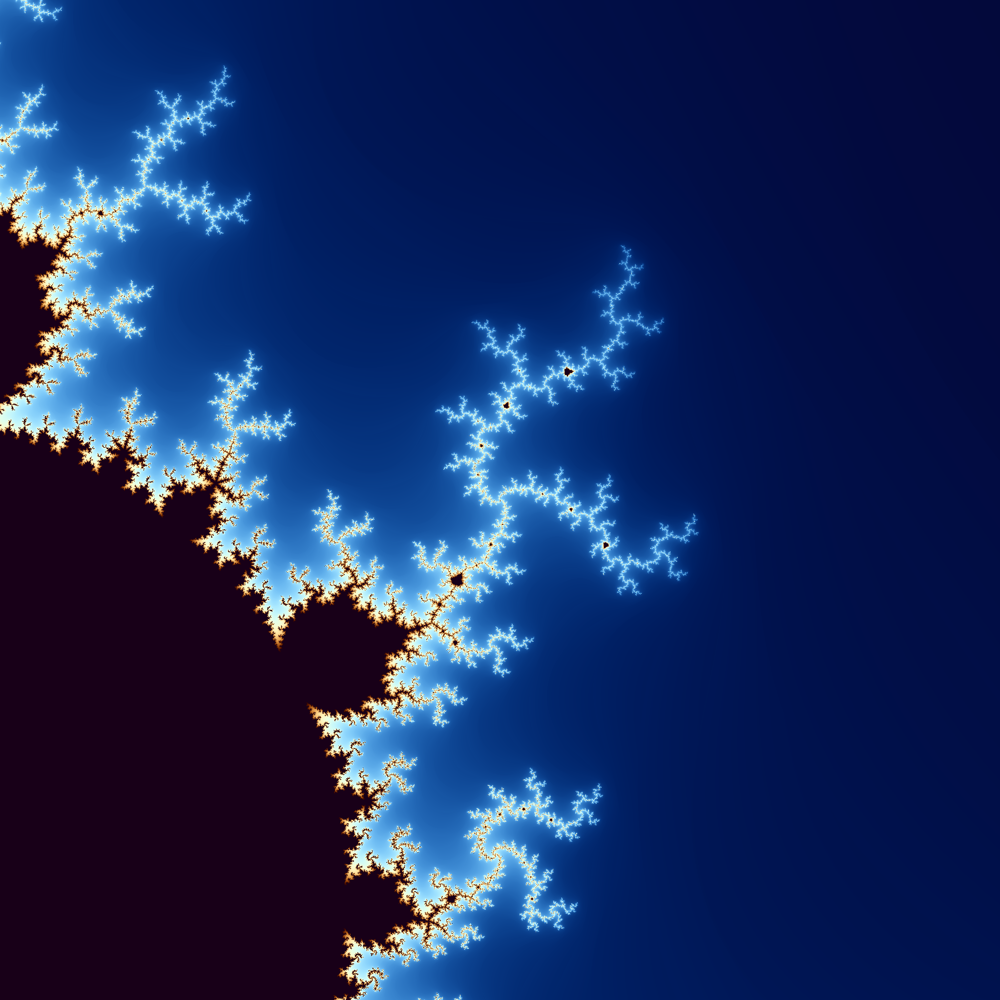

# A Gentle Introduction Into The Mandelbrot Set

## Description

This serves as a gentle introduction to both Rust and the worlderful world of fractal rendering.
The current branch (l6_optimazation) provides an implementation of the mandelbrot function which is further optimized to reduce expensive operations. 
For more complex upgrades, you can visit the other branches.

## Screenshots

